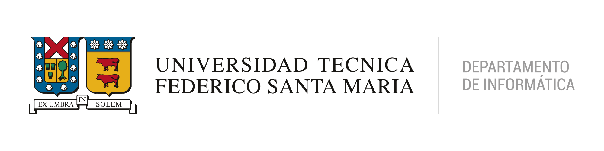

# IWI-131: Programación

Versión web del material del curso. ***En desarrollo...***

**NOTA:** Los ejemplos de Trinket pueden cargar de manera incorrecta, pero al utilizar la opción *RESET* del menú se puede corregir.

## Compilado de ejercicios

Puede acceder a los ejercicios revisados en clases en este **[enlace](https://progra-utfsm.github.io/ejercicios/)**.

## Contacto

Si encuentra algún error, tiene una sugerencia y/o comentario por favor notificarlo a **[daniel.sanmartinr@usm.cl](mailto:daniel.sanmartinr@usm.cl)**

## Créditos

Material desarrollado por:

- Cristopher Arenas
- Sergio Campos
- Nicolas Gálvez
- Daniel San Martín

Revisado y mejorado por:

- Andrea Vásquez
- Federico Meza
- Ignacio Jorquera
